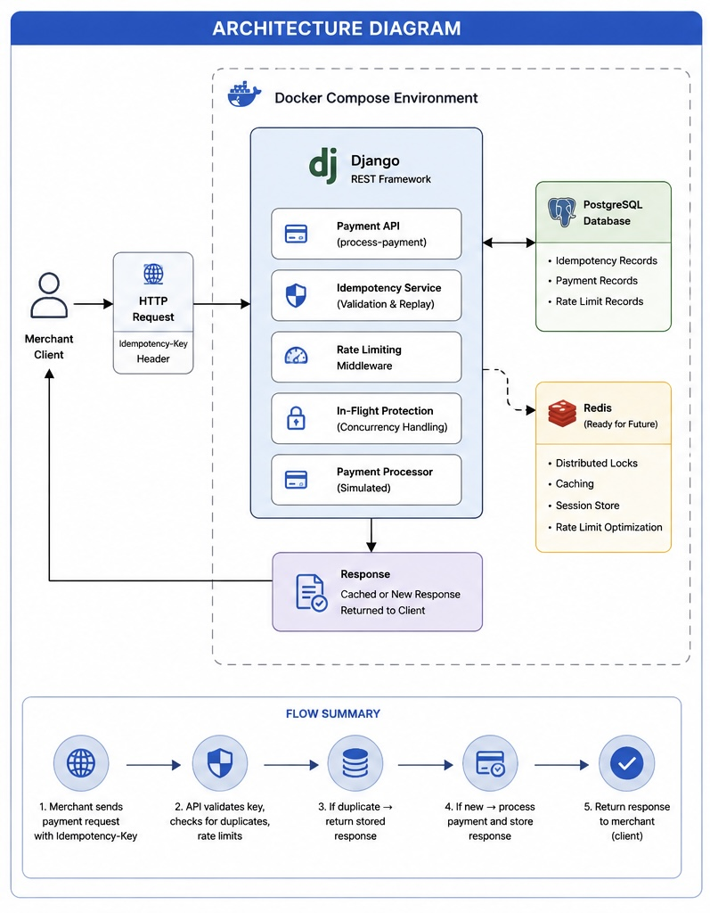
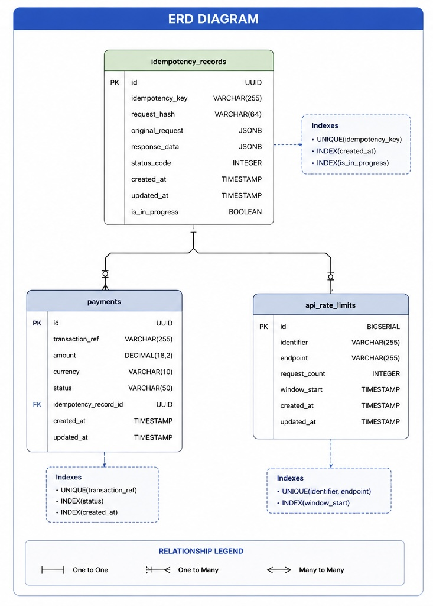

# Idempotency Gateway – Pay Once Protocol.

A production-inspired payment API built with **Django REST Framework**, **PostgreSQL**, **Redis**, and **Docker** that guarantees payment requests are processed **exactly once**.

Built for the FinSafe Transactions Ltd challenge to solve duplicate customer charges caused by retries, timeouts, or unstable networks.

---

# Table of Contents.

1. Project Overview
2. Business Problem
3. Solution Summary
4. Key Features
5. Architecture Diagram
6. ERD Diagram
7. Tech Stack
8. Quick Start (Run Entire Project)
9. Environment Variables
10. API Usage Guide
11. Testing with cURL (Step-by-Step)
12. Automated Unit Tests
13. Design Decisions
14. Developer Choice Feature
15. Future Improvements

---

# 1. Project Overview.

This system acts as a payment gateway protection layer.

When a merchant sends a payment request:

- If it is the **first request**, payment is processed normally.
- If the **same request is retried**, the previous response is returned instantly.
- If the **same key is reused with modified payment details**, request is rejected.
- If two duplicate requests arrive at the same time, only one payment is processed.

---

# 2. Business Problem.

Payment systems often experience:

- Network timeouts
- Slow client connections
- Automatic retries from merchants

Without idempotency protection:

```text
Customer clicks Pay once
↓
Merchant retries request
↓
Customer charged twice
```

This causes:

- Refund losses
- Customer complaints
- Regulatory risk
- Merchant trust issues

# 3. Solution Summary.

Each request must include:

**Idempotency-Key: unique-string**

The system stores:

- Request fingerprint (hash)
- Original request payload
- Original response body
- Status code

If the same request returns later:

- Payment is NOT processed again
- Original response is replayed instantly

# 4. Key Features.

- Idempotent payment processing
- Duplicate request replay
- Fraud detection for changed payloads
- Concurrency-safe duplicate handling
- Rate limiting (10 requests/minute/IP)
- Dockerized setup
- PostgreSQL persistence
- Redis-ready architecture
- Django Admin support
- Automated unit tests

# 5. Architecture Diagram.



# 6. ERD Diagram.



# 7. Tech Stack.

| Component            | Technology            |
| -------------------- | --------------------- |
| Backend API          | Django REST Framework |
| Language             | Python 3.12           |
| Database             | PostgreSQL            |
| Cache / Future Locks | Redis                 |
| Containerization     | Docker Compose        |
| Testing              | Django Test Framework |

# 8. Quick Start (How to run entire project).

## Step 1: Clone Repository.

- git clone <your-github-repo-url>
- cd idempotency-gateway

## Step 2: Create Environment File.

- cp .env.example .env

## Step 3: Start Containers.

- docker compose up --build

This starts:

- Django API server
- PostgreSQL database
- Redis service

## Step 4: Run Database Migrations.

Open another terminal then run:

- docker compose exec web python manage.py makemigrations
- docker compose exec web python manage.py migrate

## Step 5: Create Admin User (OPTIONAL).

- docker compose exec web python manage.py createsuperuser

## Step 6: Access Project.

API Base URL

- **http://localhost:8000/api/v1/**

Admin Panel

- **http://localhost:8000/admin/**

# 9. Environment Variables.

```text
DEBUG=True
SECRET_KEY=your-secret-key

DB_NAME=paymentdb
DB_USER=paymentuser
DB_PASSWORD=paymentpass
DB_HOST=db
DB_PORT=5432

POSTGRES_DB=paymentdb
POSTGRES_USER=paymentuser
POSTGRES_PASSWORD=paymentpass

REDIS_URL=redis://redis:6379/1
```

# 10. API Usage Guide.

**Process Payment Endpoint:**

- POST /api/v1/process-payment

**Required Headers:**

- Idempotency-Key: payment-123
- Content-Type: application/json

**Request Body:**

```text
{
  "amount": 100,
  "currency": "RWF"
}
```

# 11. Testing with cURL.

## A. First Payment Request.

```text
curl -i -X POST http://localhost:8000/api/v1/process-payment \
-H "Content-Type: application/json" \
-H "Idempotency-Key: payment-001" \
-d '{"amount":100,"currency":"RWF"}'
```

**Expected Result:**

- waits about 2 seconds
- returns:

```text
HTTP/1.1 201 Created
```

**_Body:_**

```text
{
  "message": "Charged 100 RWF",
  "transaction_ref": "generated-uuid"
}
```

## Duplicate Request (Same Key + Same Body).

**Run same command again:**

```text
curl -i -X POST http://localhost:8000/api/v1/process-payment \
-H "Content-Type: application/json" \
-H "Idempotency-Key: payment-001" \
-d '{"amount":100,"currency":"RWF"}'
```

**Expected Result:**

- Returns instantly.
- Headers include:

```text
HTTP/1.1 201 Created
X-Cache-Hit: true
```

- **Same body as original request:**

```text
{
  "message": "Charged 100 RWF",
  "transaction_ref": "same-original-uuid"
}
```

**Meaning:**

- No second payment was processed.
- Cached original response was replayed.

## C. Fraud Attempt (Same Key + Different Body).

```text
curl -i -X POST http://localhost:8000/api/v1/process-payment \
-H "Content-Type: application/json" \
-H "Idempotency-Key: payment-001" \
-d '{"amount":500,"currency":"RWF"}'
```

**Expected Result:**

- HTTP/1.1 422 Unprocessable Entity

```text
{
  "error": "Idempotency key already used for a different request body."
}
```

**Meaning:**
A previously used key cannot authorize a different payment.

## D. Missing Header.

```text
curl -i -X POST http://localhost:8000/api/v1/process-payment \
-H "Content-Type: application/json" \
-d '{"amount":100,"currency":"RWF"}'
```

**Expected:**

- HTTP/1.1 400 Bad Request

## E. Rate Limit Test.

Run many requests quickly:

```text
for i in {1..12}; do
curl -X POST http://localhost:8000/api/v1/process-payment \
-H "Content-Type: application/json" \
-H "Idempotency-Key: key-$i" \
-d '{"amount":100,"currency":"RWF"}'
done
```

**Expected eventually:**

- HTTP/1.1 429 Too Many Requests

```text
{
  "error": "Rate limit exceeded."
}
```

# 12. Automated Unit Tests.

Run all tests:

- docker compose exec web python manage.py test

**_Expected Output Example:_**

```text
Ran 7 tests in 8.21s

OK
```

## Meaning of Output

```text
Ran 7 tests
```

The project executed 7 separate verification checks.

```text
OK
```

All tests passed successfully.

**_If a Test Fails:_**
You may see:

```text
FAILED (failures=1)
```

This means one expected behavior did not match actual output.

## Covered Test Cases

- Missing Idempotency-Key returns 400
- First payment returns 201
- Duplicate request returns cached replay
- Duplicate includes X-Cache-Hit: true
- Same key + changed body returns 422
- Invalid negative amount rejected
- Rate limit returns 429

# 13. Design Decisions.

**Why Django?**

- Fast API development
- Secure defaults
- Strong ORM
- Reliable production ecosystem

**Why PostgreSQL?**

- ACID transactions
- Production-grade database
- Strong indexing support

**Why Redis?**
Prepared for:

- distributed locks
- caching
- scaling

**Why Docker?**
Allows reviewer to run project with one command:

- **_docker compose up --build_**

# 14. Developer Choice Feature.

**Rate Limiting**
Added 10 requests/minute/IP to protect payment endpoints from:

- abuse
- infinite retry loops
- accidental floods
- brute-force behavior

**DOCKER**
Contenarized our API in Docker Containers to ensure consistency across all reviewers and environment whether it is development or production.

# 15. Future Improvements.

- JWT merchant authentication
- Swagger / OpenAPI docs
- Celery background workers
- Prometheus metrics
- CI/CD pipeline
- Nginx reverse proxy
- Cloud deployment (AWS / Railway / Render /CloudFare)

# Final Review Note

To run project from scratch:

- git clone <repo-url>
- cd idempotency-gateway
- cp .env.example .env
- docker compose up --build
  **open new terminal window**
- docker compose exec web python manage.py makemigrations
- docker compose exec web python manage.py migrate

Then test with cURL examples above.

# Important Note.

Docker is required to run this project consistently across environments.
It was intentionally containerized to ensure simple setup, predictable dependencies, and reviewer convenience.
